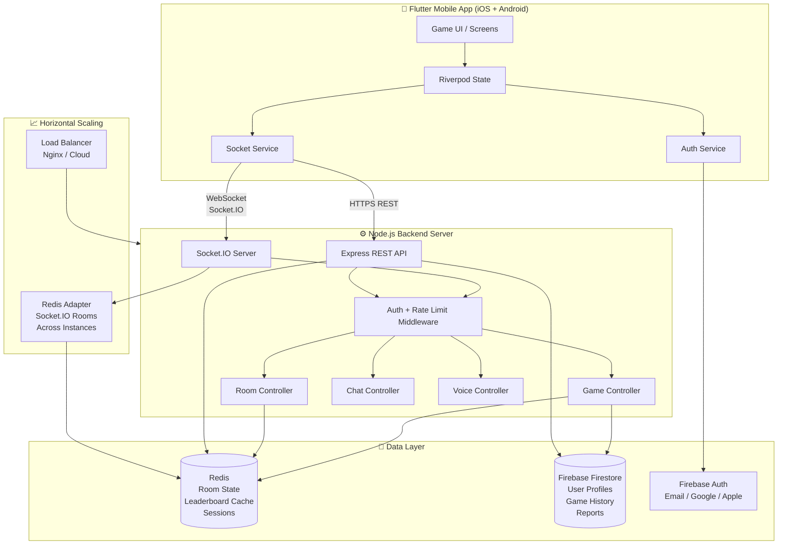
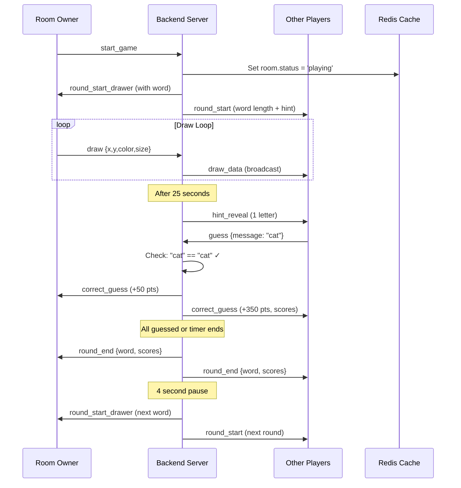
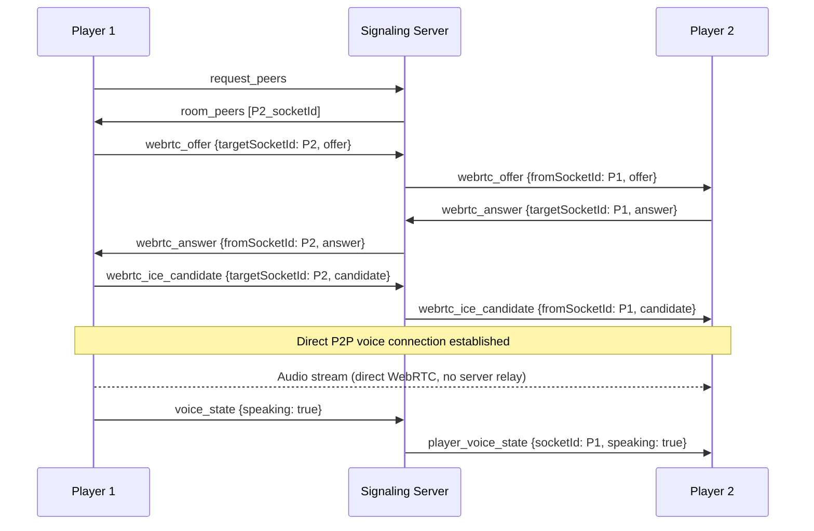

# Kirik Architecture

## System Architecture Diagram



## Data Flow: Game Round



## WebRTC Voice Chat Flow



## Database Schema

### Firestore Collections

```
users/
  {userId}/
    username: string
    email: string
    avatar: string
    level: number
    totalScore: number
    totalGames: number
    wins: number
    friends: string[]   // array of userIds
    createdAt: timestamp
    lastPlayedAt: timestamp

game_history/
  {gameId}/
    roomId: string
    language: string
    totalRounds: number
    playerCount: number
    leaderboard: [{userId, username, score}]
    endedAt: timestamp

reports/
  {reportId}/
    reporterId: string
    reporterName: string
    targetUserId: string
    reason: string
    roomId: string
    status: 'pending' | 'reviewed' | 'actioned'
    createdAt: timestamp

weekly_scores/
  {docId}/
    userId: string
    username: string
    score: number
    weekStart: timestamp
```

### Redis Key Schema

```
room:{roomId}               → JSON (Room state, TTL: 2h)
room_code:{CODE}            → roomId string (TTL: 2h)
public_rooms                → Set of roomIds
leaderboard:global          → Sorted set (userId → totalScore)
leaderboard:weekly          → Sorted set (userId → weekScore, TTL: end of week)
```
